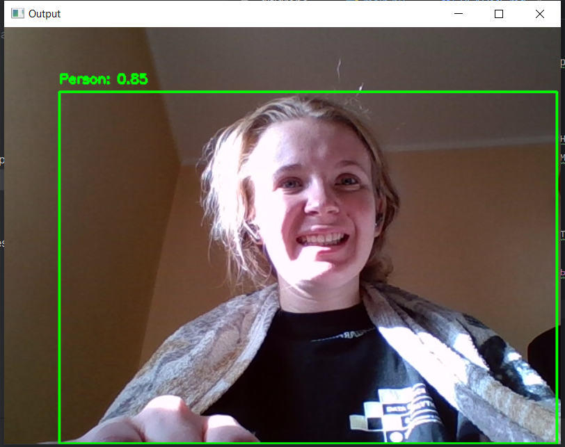

# Обнаружение объектов с использованием YOLO и сохранение видео

Этот проект использует нейронную сеть YOLOv8 для обнаружения объектов на видеовходах. Пользователи могут выбрать виде файл или использовать веб-камеру, а также сохранить обработанное видео в файл.
Проект одним коммитом, т.к. ранее вёлся на гитлабе.
## Возможности

- Выбор между веб-камерой и файлом видео в качестве источника.
- Обнаружение объектов с использованием YOLOv8.
- Вывод видео с наложенными рамками.
- Возможность сохранить обработанное видео в формате MP4.
- Вообще имба проект.

## Требования

- Python 3.x
- OpenCV
- Tkinter
- Ultralytics (библиотека YOLO)

## Установка

1. **Клонируйте репозиторий**:
    ```
    git clone https://git.miem.hse.ru/aakurenkova_5/test_task_for_ul_laboratory.git
    ```

2. **Создайте и активируйте виртуальное окружение в терминале (рекомендуется)**:
    ```
    python -m venv venv
    source venv/bin/activate  # Для Linux/Mac
    .\venv\Scripts\activate   # Для Windows
    ```

3. **Установите необходимые библиотеки в терминале, да, много весят, а я чо**:
    ```bash
    pip install opencv-python-headless tk ultralytics
    ```

## Использование

1. **Запустите скрипт**:
    python main.py

2. **Следуйте инструкциям**:
   - Выберите, хотите ли вы использовать веб-камеру или файл видео.
   - Укажите место для сохранения обработанного видео.

3. **Наблюдайте за результатами**:
   - Обработка изображения в реальном времени с отображением результатов обнаружения.

## Замечания

- Убедитесь, что вы используете правильную версию Python и необходимые библиотеки установлены.
- Обработка больших видео может занять мнооооого времени, наберитесь терпения, Москва тоже не сразу строилась.

## Поддержка

Если у вас возникли вопросы или сложности, пожалуйста, напишите на почту aakurenkova_5@edu.hse.ru
 
## Интерфейс (если это можно так назвать)
Пример использования с вебкамерой



Пример использования программы с готовым видео

